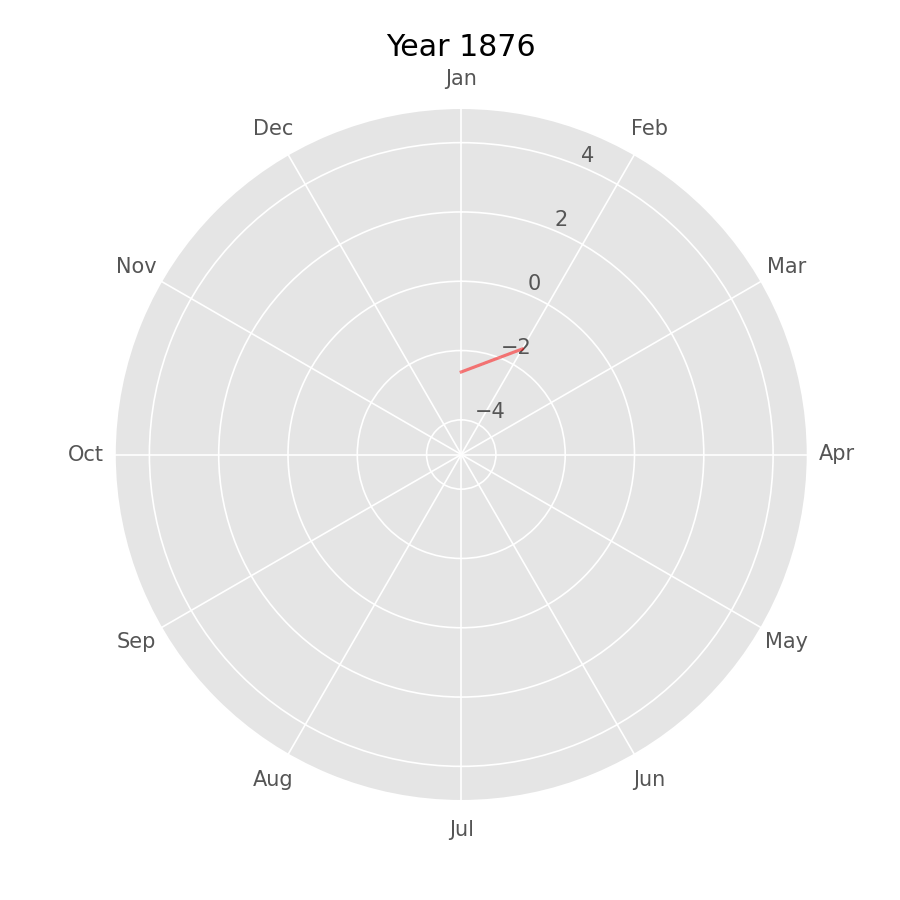

# Tokyo Temp. Circular Plot

## データ

- NASAのClimate spiralを参考にして、東京都のデータで実装したものです。
  - https://en.wikipedia.org/wiki/Climate_spiral
- データは気象庁の「日平均気温」を持ってきました
  - https://www.data.jma.go.jp/obd/stats/etrn/view/monthly_s3.php?prec_no=44&block_no=47662
  - 一部「)」などがついているデータは手作業で落としました。
  - 処理したCSVファイルは data/tokyo.csv にあります。
  

## 処理

- `main.py` を見てください
- Climate spiralの正確なデータ処理は調べていないので、次のように処理しました
  - 全データの各月の平均気温を計算し、個別データは差分を保持する
  - 各月のデータをpolar軸でプロットする

## 出来たもの

